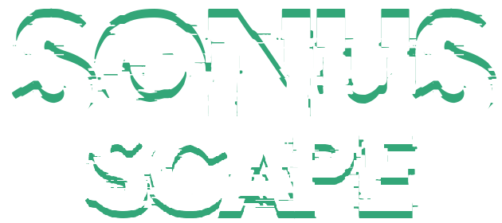

  

# SonusScape (Working Title)
#### *Nothing is final and everything is subject to change.*

## **High Concept:** 
SonusScape is a 2D Platformer where you take control of a blind robot and use a hand-held Sonar device in order to reveal the levels and solve puzzles.

  

## Developer's Info:
IDE: [PyCharm Community Edition](https://www.jetbrains.com/pycharm/)

# **Setup Instructions:**
1. 
2.
3.
4.
5.
